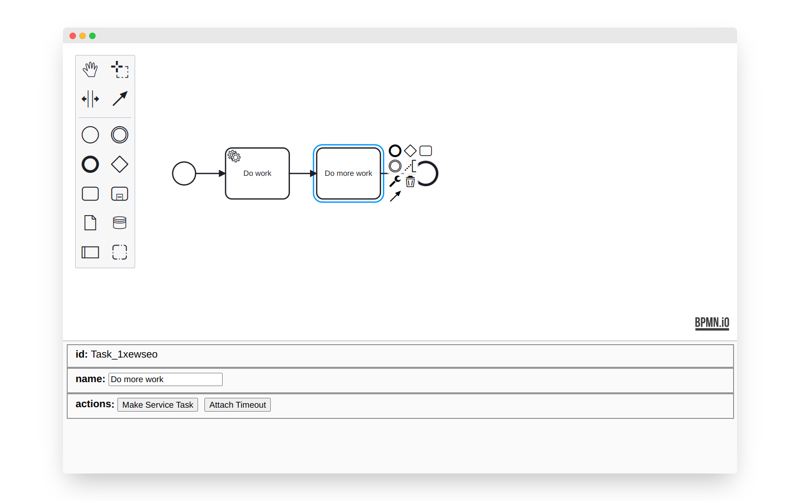

# React Properties Panel for bpmn-js

This example demonstrates a custom properties panel for [bpmn-js](https://github.com/bpmn-io/bpmn-js) written in [React](https://reactjs.org/).



## About

The component [`PropertiesView`](https://github.com/bpmn-io/bpmn-js-example-react-properties-panel/blob/master/app/properties-panel/PropertiesView.js) implements the properties panel. 

The component is mounted via standard React utilities and receives the BPMN modeler instance as props:

```js
ReactDOM.render(
  <PropertiesView modeler={ modeler } />,
  container
);
```

As part of its life-cycle hooks it hooks up with bpmn-js change and selection events to react to editor changes:

```js
class PropertiesView extends React.Component {

  ...
  
  componentDidMount() {
  
    const {
       modeler
    } = this.props;
    
    modeler.on('selection.changed', (e) => {
      this.setElement(e.newSelection[0]);
    });

    modeler.on('element.changed', (e) => {
      this.setElement(e.element);
    });
  }

}
```

Rendering the component we may display element properties and apply changes:

```js
class PropertiesView extends React.Component {
  
  ...
  
  render() {
  
    const {
      element
    } = this.state;
    
    return (
      <div>
        <fieldset>
          <label>id</label>
          <span>{ element.id }</span>
        </fieldset>

        <fieldset>
          <label>name</label>
          <input value={ element.businessObject.name || '' } onChange={ (event) => {
            this.updateName(event.target.value);
          } } />
        </fieldset>
      </div>
    );
  }
  
  updateName(newName) {
  
    const {
      element
    } = this.state;
    
    const { 
      modeler
    } = this.props;
    
    const modeling = modeler.get('modeling');
    
    modeling.updateLabel(element, newName);
  }
}
```


## Run the Example

```sh
npm install
npm start
```


## License

MIT
